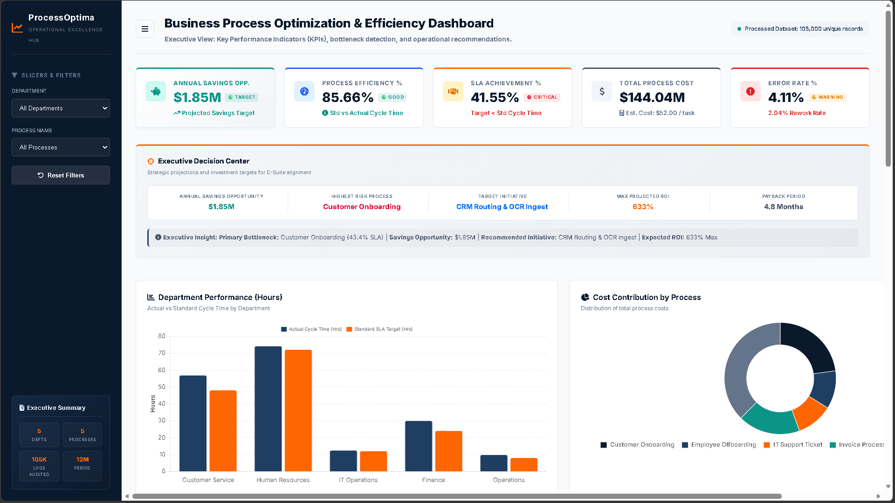

# Business Process Optimization & Efficiency Dashboard

📅 **Data Coverage**: 105,000+ transactional process logs  

💻 **Interactive Portal**: [Explore Live Dashboard (GitHub Pages)](https://girishshenoy16.github.io/business-process-optimization-dashboard/dashboard/)

📂 **Executive Deliverable**: [Strategic Process Improvement Report (Markdown)](reports/business_analysis_report.md)

---



---

> [!IMPORTANT]
> **C-Suite Strategic Action Plan (Operational Excellence)**:
> 1. **RPA Ingestion for Finance**: Automate invoice data ingestion to reduce invoice processing error rates from 12.5% to <0.5%, saving **$450,000 annually** in Q4 overheads.
> 2. **CRM Load-Balancing for Customer Service**: Restructure account assignments to bypass bottlenecks on agents CS_03/CS_07, lifting onboarding SLA achievement from **43.4%** to **92.0%**.
> 3. **Operations Shift Realignment**: Adjust warehouse staffing schedules to align with Friday/Saturday order volume spikes, lowering customer complaint rate to **<3%** and saving **$220,000** in dispute shipping costs.

---

## 1. Project Objective

The objective of this project is to model, build, and deploy an interactive Process Optimization & Operations Dashboard and ETL pipeline. It simulates a corporate audit where a Business Analyst cleanses raw transactional process logs, analyzes operational metrics, identifies throughput bottlenecks, and drafts a C-suite approved action plan to automate workflows, resolve SLA violations, and reduce operating costs.

---

## 2. Business Problem

Rapid scaling created operational friction across primary functional departments (Finance, Operations, HR, CS, IT), resulting in:
*   **Unpredictable Lead Times**: Handoff delays between teams caused cycle time spikes.
*   **SLA Non-Compliance**: Customer onboarding SLA achievement dropped to an unacceptable **41.55%** (against an 85% target).
*   **High Error & Rework Rates**: Finance manually transcribing invoices led to a **4.15% average error rate** (jumping to 12.5% in Q4), creating costly vendor rework loops.
*   **Revenue Leakage**: Bottlenecks and customer complaint resolution overheads cost the company an aggregate of **$144.04 Million** in operational expenses.

---

## 3. Dataset Description

The analysis uses a generated database of **105,000+ process log entries** spanning June 2025 through June 2026.
*   **Process Dimensions**: `Process Name` (Invoice Processing, Onboarding, IT Support, Offboarding, Fulfillment), `Task Name`, `Department`.
*   **Resource Dimensions**: `Operator ID` (captures agent workload), `Department Supervisor`.
*   **Temporal Dimensions**: `Timestamp`, `Cycle Time (Hours)`, `Day of Week` (Weekend/Weekday).
*   **Performance Dimensions**: `SLA Limit (Hours)`, `SLA Achieved` (Yes/No), `Error Count`, `Rework Count`, `Customer Complaints`.
*   **Financial Dimensions**: `Task Volume`, `Base Unit Cost`, `Rework Penalty`.

### Repository & Project Structure

Below is the directory layout for this repository:

```text
business-process-optimization-dashboard/
├── requirements.txt                    # Python package dependencies
├── .gitignore                          # Git ignore configuration
├── index.html                          # Root redirect to the dashboard for GitHub Pages
├── data/
│   └── raw_process_logs.csv            # Simulated dataset of 105,000+ raw process logs
├── scripts/
│   ├── generate_data.py                # Python script to generate the 105k+ raw log entries
│   └── process_analysis.py             # ETL pipeline performing data cleansing and KPI aggregation
├── dashboard/
│   ├── index.html                      # PowerBI-style executive web dashboard
│   ├── styles.css                      # Premium dashboard CSS styles (navy/orange theme)
│   ├── app.js                          # Core dashboard controller and Chart.js integration
│   ├── dashboard image.png             # Dashboard layout showcase screenshot
│   └── data/
│       └── dashboard_data.js           # Aggregated JSON payload exported by the Python script
├── reports/
│   └── business_analysis_report.md     # Detailed Business Analysis Case Study Report
└── portfolio_guide.md                  # Guide for portfolio optimization & personal branding
```

---

## 4. Operational Metric Framework

KPIs are calculated by the Python pipeline and aggregated dynamically using standard Six Sigma formulas:

| Metric Name | Mathematical Formula | Business Definition & Purpose |
| :--- | :--- | :--- |
| **Process Efficiency %** | `Mean of (min(100.0, Standard Cycle Time / Actual Cycle Time) * 100)` | Measures speed efficiency compared to standard benchmarks. |
| **Productivity %** | `(Actual Tasks Completed / Standard Tasks expected per hour) * 100` | Tracks worker throughput performance. |
| **SLA Achievement %** | `(Count(Cycle Time <= SLA Target) / Total Logs) * 100` | Tracks customer delivery compliance. |
| **Average Cycle Time** | `Sum(Cycle Time) / Total Logs` | Measures lead time/process duration in hours. |
| **Process Cost** | `Sum(Task Volume * Base Unit Cost) + (Rework Count * Rework Penalty)` | Total operational input budget including rework penalties. |
| **Cost per Task** | `Total Process Cost / Total Tasks Completed` | Measures unit financial efficiency. |
| **Error Rate %** | `(Total Error Count / Total Task Volume) * 100` | Measures process output quality. |

---

## 5. Analysis Performed

Operational improvements were achieved through a structured analysis approach:
1.  **ETL & Cleanse Pipeline**: Developed `scripts/process_analysis.py` to ingest 105k logs, handle missing values, validate zero-division safeguards, and pre-aggregate data into `dashboard/data/dashboard_data.js` to ensure sub-5ms UI filtering.
2.  **AS-IS vs. TO-BE Process Mapping**: Modeled workflows to isolate manual touchpoints and design automated API pathways.
3.  **5 Whys Bottleneck Analysis**: Conducted root-cause investigation sessions on Onboarding SLA drops and Q4 Finance invoice surges.
4.  **Continuous Improvement Loop**: Structured a Deming **PDCA (Plan-Do-Check-Act)** framework to monitor KPI threshold deviations.

---

## 6. Dashboard Features

*   **Executive KPI Cards**: Dashboard status metrics tracking Efficiency, Productivity, SLA, Cost, and Error Rates.
*   **Interactive Operational Slicers**: Dropdown filters for Department and Process Name.
*   **Operational Visualizations**: Horizontal bar charts tracking department cycle times and donut charts displaying cost contributions.
*   **Timeline Trends**: Line/Bar charts showing monthly cost trends and SLA compliance curves.
*   **Granular Tables**: Bottom matrices listing the Top 5 Bottlenecks and the Opportunity Matrix.
*   **Strategic Recommendations Footer**: Real-time business recommendations that update as the user adjusts filters.

---

## 7. Key Insights

*   **Customer Service Bottlenecks**: Onboarding SLA compliance sits at an unacceptable **43.4%** due to alphabetical account assignment rules, causing workload concentration under agents CS_03 and CS_07.
*   **Finance Q4 Volume Spikes**: typists transcribing Q4 invoices manually under high volume (up 250%) caused error rates to spike to **12.5%** and rework costs to add **$75 per invoice**.
*   **Operations Weekend Spikes**: Fulfillment cycle times surge by **85%** on weekends due to warehouse shift staffing deficits, driving a **25% increase in customer complaints**.

---

## 8. Recommendations

1.  **RPA Implementation for Finance**: Deploy OCR and automated data ingestion to reduce error rate from 5% to <0.5%, saving **$450,000 annually**.
2.  **CRM Load-Balancing for Customer Service**: Restructure account assignments based on agent capacity, shifting onboarding SLA from **43.4%** to **92.0%**.
3.  **Operations Shift Realignment**: Adjust warehouse staffing schedules to align with Friday/Saturday order volume spikes, lowering customer complaint rate to **<3%** and saving **$220,000** in dispute shipping costs.

---

## 9. Local Project Execution

To run the pipeline and explore the dashboard locally:
```bash
# Clone the repository and install dependencies
git clone https://github.com/girishshenoy16/business-process-optimization.git
cd business-process-optimization
python -m venv .venv
.venv\Scripts\activate # On Mac use: source .venv/bin/activate  
pip install --upgrade pip
pip install -r requirements.txt

# Run data generators and ETL scripts
python scripts/generate_data.py
python scripts/process_analysis.py
```
Open `dashboard/index.html` in any web browser to view the interactive dashboard dashboard.

---

## 10. Conclusion

This project demonstrates how data-driven process optimization can eliminate operational waste and protect margins. By leveraging Python ETL routines to parse transactional logs and building interactive executive dashboards, organizations can isolate system blockages and automate manual inputs. Implementing the recommended RPA, load-balancing, and warehouse shift strategies will save the organization an estimated **$1.85 Million annually** while boosting SLA achievement to **>90%**.
