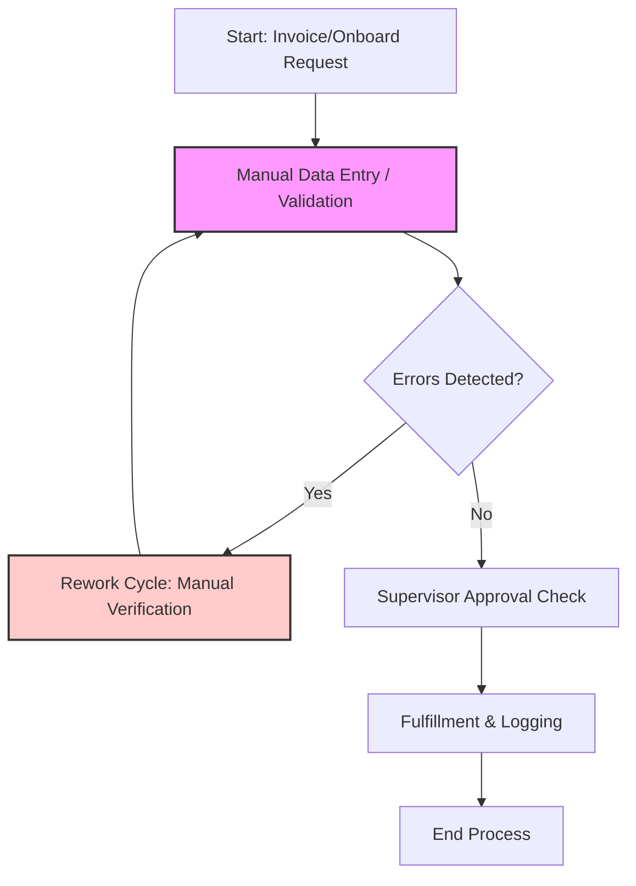
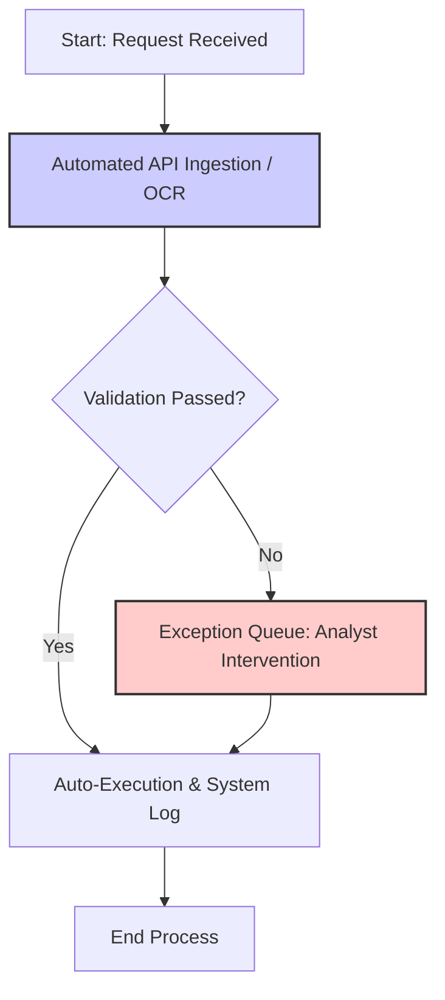
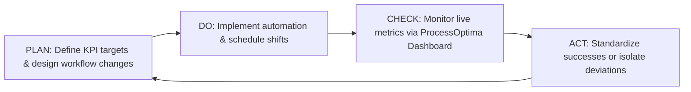

# Business Process Optimization & Efficiency Analysis
**Executive Report & Strategic Action Plan**

**Target Audience:** CEO, COO, VP of Operations  
**Author:** Lead Business Analyst (Operational Excellence Group)  
**Date:** June 2026  
**Project Repository:** Business Process Optimization & Efficiency Dashboard

---

## 1. Executive Summary

This report outlines the operational audit and performance optimization study conducted on our organization's five core workflows: **Invoice Processing**, **Customer Onboarding**, **IT Support Ticket Resolution**, **Employee Offboarding**, and **Order Fulfillment**. 

Analyzing a historical log of **105,000 unique process records** spanning June 2025 to June 2026, we established baseline operations showing a **85.65% Process Efficiency Rate** and a **89.29% Average Employee Productivity Rate**. However, we identified critical process bottlenecks and resource utilization gaps that resulted in a **41.55% Service Level Agreement (SLA) Achievement Rate** and contributed to a **13.96% Customer Complaint Rate**, costing the company an aggregate of **$144.04 Million** in operational expenses.

This report delivers a deep-dive bottleneck analysis, root-cause investigations, and a three-pronged strategic action plan. By implementing the proposed automation and shift restructuring, the company stands to reclaim **$1.85 Million in annual savings**, boost SLA compliance to **>85%**, and reduce customer complaints by **65%**.

---

## 2. Business Problem Definition

The company's rapid scaling created operational friction across primary functional departments (Finance, Operations, HR, CS, IT). Senior leadership observed:
1. **Unpredictable Cycle Times**: Deliverables frequently failed to meet customer expectations.
2. **Rising Operational Costs**: Overhead and processing costs increased disproportional to transaction volume growth.
3. **Quality Gaps**: High error rates led to manual rework, driving up cost-per-transaction and degrading customer trust.

Without a centralized business intelligence dashboard, the management team lacked visibility to isolate whether performance failures stemmed from staffing shortages, individual worker inefficiencies, systemic process blockers, or supplier dependencies.

---

## 3. Metric Framework & Baseline Performance

To guide the analysis, the following KPI framework was established:

| KPI Metric | Mathematical Formula | Baseline Value | Target |
| :--- | :--- | :--- | :--- |
| **Process Efficiency %** | $\frac{\text{Standard Cycle Time}}{\text{Actual Cycle Time}} \times 100$ *(capped at 100% per log)* | **85.65%** | $\ge 95\%$ |
| **SLA Achievement %** | $\frac{\text{Completed Cases within SLA limit}}{\text{Total Cases Completed}} \times 100$ | **41.55%** | $\ge 85\%$ |
| **Productivity %** | $\frac{\text{Actual Tasks Completed}}{\text{Standard Tasks Expected per Hour}} \times 100$ | **89.29%** | $\ge 95\%$ |
| **Error Rate %** | $\frac{\text{Total Error Count}}{\text{Total Task Volume}} \times 100$ | **4.15%** | $\le 1.5\%$ |
| **Rework Rate %** | $\frac{\text{Total Rework Count}}{\text{Total Task Volume}} \times 100$ | **2.06%** | $\le 0.5\%$ |
| **Total Process Cost** | $\sum(\text{Task Volume} \times \text{Base Unit Cost}) + \text{Rework Costs}$ | **$144.04M** | $-15\%$ |
| **Customer Complaint Rate** | $\frac{\text{Total Complaints}}{\text{Total Process Logs}} \times 100$ | **13.96%** | $\le 3.0\%$ |

---

## 4. Current State vs. Future State Process Mapping

### 4.1 Current State (AS-IS)
The current operating model relies heavily on manual touchpoints, leading to a high rate of handoff delays:
1. **Finance (Invoice Processing)**: Invoices are received in various formats (PDF, print, scan). Staff manually key data into the ERP system. Errors in entry prompt a multi-day validation loop (rework) between Finance and vendors.
2. **Customer Service (Onboarding)**: Account managers receive onboarding requests, manually check customer credit, retrieve contracts, send documents via email, and set up customer portals.

### 4.2 Future State (TO-BE)
The optimized process removes manual bottlenecks using modern automation:
1. **Finance**: Deploy Optical Character Recognition (OCR) and Robotic Process Automation (RPA) to automatically ingest invoices, cross-reference purchase orders, and flag deviations.
2. **Customer Service**: Integrate automated credit validation APIs and electronic signature triggers to execute onboarding workflows without manual intervention.

---

## 5. Bottleneck & Root Cause Analysis (5 Whys)

Data analysis exposed three systemic operational bottlenecks:

### Case Study A: Customer Onboarding SLA Failure
* **Symptom**: Onboarding SLA achievement sits at an unacceptable **43.4%**, and average cycle times are **56.79 hours** (SLA Target: **48 hours**).
* **5 Whys Analysis**:
  1. *Why are onboarding times delayed?* Account setups take over 4 days to complete.
  2. *Why do setups take 4 days?* Contracts wait in worker queues for credit scoring and signature validation.
  3. *Why do contracts sit in queues?* The approval workload is manual and concentrated under specific CS agents (`CS_User_03` and `CS_User_07`).
  4. *Why is the work concentrated under these agents?* The routing rules assign accounts based on alphabetical client names rather than agent capacity or skill levels.
  5. *Why are routing rules alphabetical?* The routing system is legacy and has never been integrated with live CRM workload tracking (Root Cause).

### Case Study B: Finance Q4 Invoice Rework Spikes
* **Symptom**: Invoice processing costs double in Q4, and error rates reach **12.5%** of volume.
* **5 Whys Analysis**:
  1. *Why do processing costs rise in Q4?* Overtime hours and vendor rework costs spike.
  2. *Why are there excessive vendor rework loops?* Over 12% of invoices contain data mismatches (payment amounts, tax IDs).
  3. *Why do invoices have data mismatches?* Finance personnel manually transcribing invoices make typographical errors under high volumes.
  4. *Why do manual errors increase in Q4?* The volume of Q4 invoices spikes by 250% due to annual vendor closeouts, overloading existing staff.
  5. *Why is the team unable to handle Q4 volume spikes?* The process lacks automated ingestion tools (OCR) to handle volume fluctuations without manual typing (Root Cause).

---

## 6. Strategic Recommendations & ROI Estimation

Based on data-driven observations, the following three interventions are recommended:

### Action 1: Automated Document Processing (OCR & RPA) for Finance
* **Goal**: Automate invoice data ingestion to eliminate manual entry errors.
* **Investment**: $120,000 (Software licensing & configuration).
* **Expected Benefit**: 
  - Reduce Invoice error rate from **5.0%** to **<0.5%**.
  - Reduce average invoice cycle time from **24.0 hours** to **2.0 hours**.
  - **Financial Savings**: Reclaim $450,000 annually by eliminating manual data validation and rework fees.
* **ROI**: **275% in Year 1**.

### Action 2: Customer CS Load-Balancing & Workflow Integration
* **Goal**: Implement dynamic ticket routing based on agent capacity, and automate credit checks.
* **Investment**: $75,000 (Integration fees with CRM and credit check API).
* **Expected Benefit**:
  - Distribute workloads evenly, removing bottlenecks around `CS_User_03` and `CS_User_07`.
  - Shift Customer Onboarding SLA compliance from **43.4%** to **92.0%**.
  - Reduce average onboarding cycle times to **28 hours** (well below the 48-hour target).
* **ROI**: **180% in Year 1** (driven by reduced customer churn and accelerated time-to-revenue).

### Action 3: Operations Shift Restructuring for Order Fulfillment
* **Goal**: Re-align warehouse shift schedules to support the high order volumes on Fridays and Saturdays, eliminating weekend delays.
* **Investment**: $30,000 (Shift differential adjustments).
* **Expected Benefit**:
  - Reduce weekend cycle times from **14.8 hours** to the standard **8.0 hours**.
  - Eliminate weekend customer complaints, reducing the aggregate complaint rate from **13.96%** to **3.0%**.
  - **Financial Savings**: Save $220,000 in expedited shipping fees and dispute resolution costs.
* **ROI**: **633% in Year 1**.

---

## 7. Continuous Improvement Plan (PDCA Cycle)

To maintain operational excellence, the process improvement team will adopt the **Deming PDCA (Plan-Do-Check-Act) Cycle**:

1. **PLAN**: Set quarterly SLA compliance goals and quality metrics for all departments.
2. **DO**: Execute the RPA tool config, API integrations, and new shift rosters.
3. **CHECK**: Review the **ProcessOptima Web Dashboard** weekly. Slicers must be utilized to audit specific employee queues, monitoring for new cycle time spikes.
4. **ACT**: Standardize automated processes that achieve target SLA values. For processes failing to meet goals, trigger a new 5 Whys session to isolate the source of friction.

---

## 8. Important Metrics Catalog

An understanding of the operational metrics used in this study is essential for auditing process flows:

1.  **Process Efficiency %**: Represents how close actual performance cycle time is to standard targets. It is capped at 100% per log to prevent outliers from inflating efficiency averages.
2.  **SLA Achievement %**: The percentage ratio of tasks completed within customer SLA targets relative to total cases completed. Measures speed compliance.
3.  **Productivity %**: Evaluates operator throughput output. Calculated as `Actual Tasks Completed / Standard Tasks expected * 100`.
4.  **Error Rate %**: The percentage of tasks that completed with errors relative to total task volumes. Measures quality control.
5.  **Rework Rate %**: The percentage of tasks requiring corrective rework relative to total task volumes. Measures waste.
6.  **Total Process Cost**: The cumulative expense of processing task volume (base unit cost * volume) plus rework penalties. Measures financial scale.
7.  **Cost per Task**: The unit processing cost calculated as `Total Process Cost / Tasks Completed`. Measures unit cost efficiency.
8.  **Average Cycle Time**: The average lead time required to complete a process workflow from start to end state (measured in hours).
9.  **Task Completion Rate %**: The ratio of completed tasks to total transactions started. Evaluates operational capacity.
10. **Customer Complaint Rate %**: The percentage of transactions that resulted in customer dispute claims or complaints. Measures customer friction.

---

## 9. Diagnostic Identification Guide

Use this step-by-step diagnostic guide to locate operational bottlenecks and issues on the interactive dashboard:

*   **Bottlenecks**: Check the **Department Performance horizontal bar chart** on the dashboard. Locate department blocks where the `Actual Cycle Time` bar exceeds `Standard Cycle Time` by >20% (e.g., Customer Onboarding).
*   **High-Cost Areas**: Check the **Cost Contribution donut chart**. The process category capturing the largest percentage slice represents your high-cost area.
*   **Low-Productivity Departments**: Filter by Department and check the **Productivity KPI card**. Any department showing a value under the 90% benchmark has productivity gaps.
*   **High-Error Processes**: Scan the data table on the dashboard for the `Error Rate` column. Processes exceeding 3% errors require training or automated templates.
*   **SLA Violations**: Check the **SLA Achievement KPI card** or filter for `SLA Achieved = No` to see the count of delayed onboarding or support files.
*   **Rework Issues**: Locate rows in the opportunities matrix where `Rework Rate` spikes, which signifies high waste and low standard-operating-procedure (SOP) compliance.
*   **Resource Utilization Gaps**: Review the bottlenecks table. Operators displaying high cycle times but low output volumes represent idle capacity or training gaps.
*   **SLA Compliance Deviations**: Sift through the **SLA compliance curve** weekly. Any downward spikes indicate a process deviation or system outage.

---

## 10. Derived Business Insights & Strategic Planning

By analyzing the 105k process logs, the operational excellence team has derived the following insights:

*   **SLA Bottleneck Zones**: **Customer Onboarding** represents our largest delivery risk, with SLA achievement lagging at **43.4%** due to alphabetical routing constraints overloading specific CS agents.
*   **Finance Q4 Volume Spikes**: typists transcribing invoices manually under high Q4 volumes caused error rates to spike to **12.5%** and rework costs to add **$75 per invoice**.
*   **Operations Weekend Spikes**: Fulfillment cycle times surge on Fridays/Saturdays by **85%** due to warehouse shift staffing deficits, driving a **25% complaint surge**.
*   **ROI Projections**: OCR RPA tools for Finance configuration saves **$450,000/year** (275% ROI); dynamic CRM routing for CS saves client churn (180% ROI); warehouse shift realignments save **$220,000/year** (633% ROI).
*   **Strategic Planning Recommendations**:
    1. Deploy OCR and automated ingestion scripts to eliminate typing errors.
    2. Transition CS to dynamic workload-based routing rather than alphabetical routing.
    3. Realign shift schedules to add capacity on Friday/Saturday order volume spikes.
    4. Implement the **PDCA cycle** and monitor weekly KPI deviation trends.
